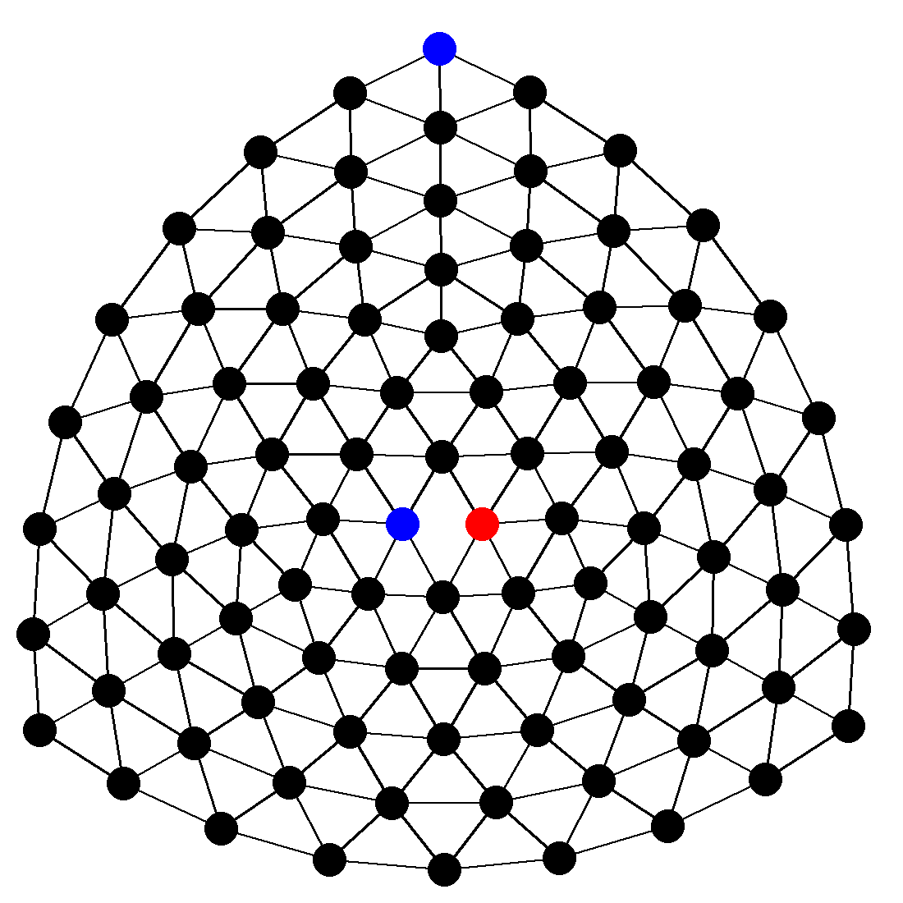

# y-game-utils

This repository hosts simple utilities for the Y game engine challenge.

As of right now, it only contains `render.py`, which is a simple script which can take a board state and a save path and create a simple rendering of what the current board state looks like. It then saves the board state as an image at the save path.

For example, with the command `python3 render.py B------------------------------------------------------------------------------------------RB image.png`, the following image is created and stored as image.png in the current directory:

Alternatively, you can just run the command `python3 render.py` and it will then expect the board state on the first line of stdin and the file path on the second line, and create the same results.

Naturally, feel free to modify the script if it helps you out. As it stands, edges between opposing colours are removed, to indicate that those can never connect, between the same colour are in that colour, indicating a path has been created, and otherwise the edges are black, showing their undecided status.
